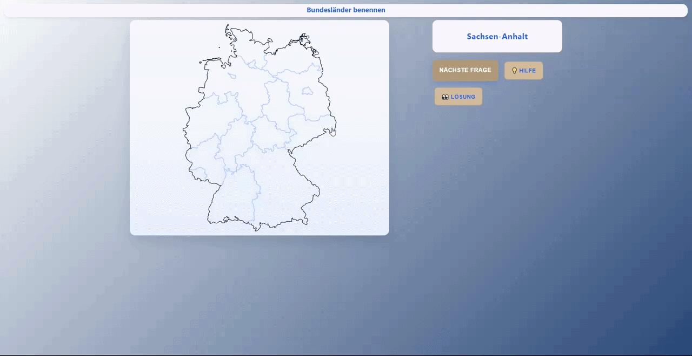

# Bundesländer benennen

## [im Browser öffnen →](https://jannis-buesing.github.io/bundeslaender-benennen/)

  

 

## Beschreibung

* **Bundesländer lernen:** Lerne die Namen der Bundesländer Deutschlands intuitiv.
* **Hilfe & Lösung:** Lass dir die Namen oder die aktuelle Lösung anzeigen.
  
  ---

## Feedback

[Fehler melden](https://github.com/jannis-buesing/bundeslaender-benennen/issues) - [Feature vorschlagen](https://github.com/jannis-buesing/bundeslaender-benennen/issues)

